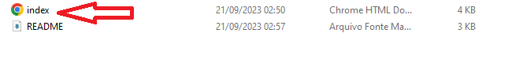
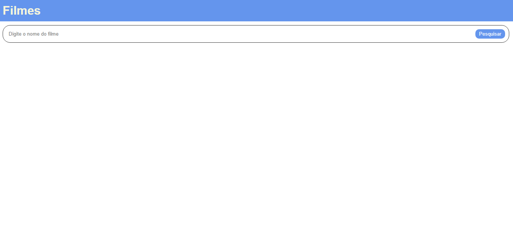
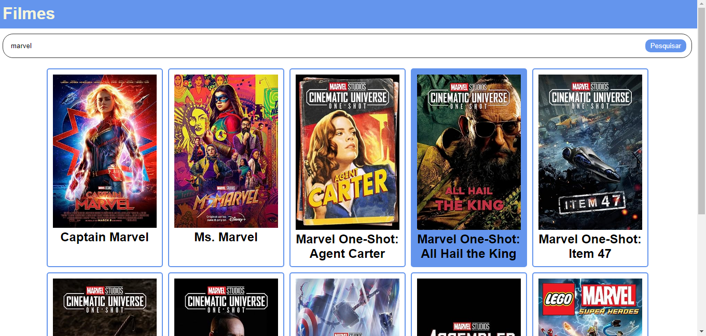

# catalogo-de-filmes

Esta é uma API simples de catálogo de filmes que permite aos usuários pesquisar filmes pelo nome e exibir os resultados em uma lista. Abaixo, você encontrará informações sobre como usar esta API e uma breve descrição do código HTML, CSS e JavaScript fornecido.

## Como Usar a API de Catálogo de Filmes

Para utilizar esta API de catálogo de filmes, siga estas etapas:

1. Clone ou faça o download deste repositório para obter o código HTML, CSS e JavaScript.

2. Abra o arquivo `index.html` em um navegador da web. Você verá uma página da web com um campo de pesquisa e uma lista vazia de filmes.

3. No campo de pesquisa, digite o nome de um filme que você deseja buscar e clique no botão "Pesquisar".

4. A API fará uma solicitação ao servidor OMDB (The Open Movie Database) e retornará uma lista de filmes correspondentes ao termo de pesquisa inserido.

5. Os resultados da pesquisa serão exibidos na parte inferior da página em uma lista de posters de filme, contendo o título do filme e uma imagem da capa.

6. Você pode clicar em qualquer posters de filme para obter mais informações sobre o filme no site do OMDB.

## Estrutura do Código

O código fornecido consiste em um arquivo HTML, estilos CSS embutidos e um script JavaScript para interagir com a API do OMDB. Aqui está uma breve descrição da estrutura do código:

- **HTML (`index.html`):** Define a estrutura da página, incluindo um cabeçalho, um campo de pesquisa e uma área para exibir os resultados da pesquisa.

- **CSS (estilos embutidos):** Fornece estilos para a página, tornando-a visualmente atraente. Os estilos incluem formatação do cabeçalho, do campo de pesquisa, dos cartões de filme e dos botões.

- **JavaScript (`<script>` no final do HTML):** Gerencia a interação do usuário com a API do OMDB. Isso inclui a captura do termo de pesquisa inserido pelo usuário, a realização de solicitações à API do OMDB e a exibição dos resultados na página.

## API OMDB

Esta API utiliza a API OMDB (The Open Movie Database) para buscar informações sobre filmes. Você precisará de uma chave de API válida para usar a API OMDB. A chave de API atualmente usada neste código é `5b091637&s`. Certifique-se de substituir esta chave pela sua própria chave de API, que você pode obter registrando-se no site do OMDB (http://www.omdbapi.com/apikey.aspx).

## Notas Importantes

- Certifique-se de que seu navegador permita solicitações de API a partir do domínio `www.omdbapi.com` ou ajuste as configurações de segurança, se necessário.

- Este código é apenas uma demonstração básica de como criar uma interface de catálogo de filmes usando a API OMDB. Você pode personalizá-lo e expandi-lo de acordo com suas necessidades.

- Tenha em mente que o OMDB oferece diferentes níveis de acesso à API, dependendo do seu plano de assinatura. Certifique-se de respeitar os termos de uso da API OMDB e de estar ciente de quaisquer limitações em relação ao uso gratuito.

